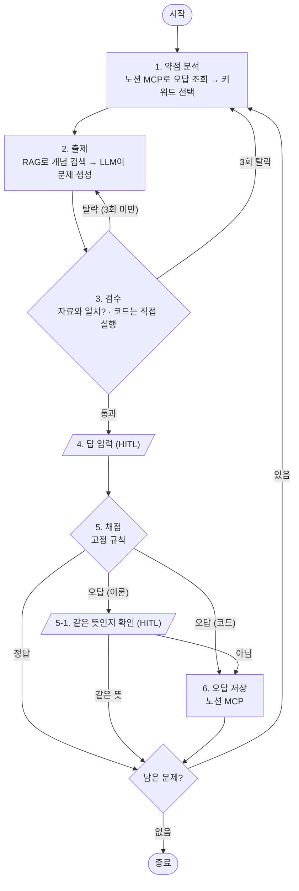

# 📝 정처기 실기 약점 맞춤 출제 에이전트

문제를 풀수록 **내가 자주 틀리는 키워드**를 찾아 노션 오답노트에 쌓고,
그 약점 위주로 **검증된 문제**를 다시 출제하는 정보처리기사 실기 학습 에이전트입니다.

> 엔코아 과제 「나만의 에이전트 설계·구현」 (B안: 직접 설계)

<!-- 캡처: 홈 화면 -->

---

## 1. 문제 정의

정처기 실기를 준비하면서 겪은 문제를 하나씩 해결하는 것이 목표입니다.

| 준비하면서 겪는 문제 | 에이전트가 하는 일 |
|---|---|
| 내가 뭘 자주 틀리는지 모르고, 오답노트 정리가 번거로움 | 틀린 문제를 **노션에 자동 저장**하고, 많이 틀린 키워드를 골라 출제 |
| 문제집은 다 풀면 끝이고, 같은 문제를 외우게 됨 | 같은 키워드도 **묻는 방식과 내용을 바꿔** 새로 출제 |
| AI에 문제를 내달라고 하면 **정답이 틀린 경우**가 많음 | 개념 자료 안에서만 출제(RAG)하고, **검수**하고, 코드 문제는 **직접 실행**해서 정답 확정 |
| 대화가 끝나면 기록이 사라짐 | 오답이 노션에 남아서 **다음 실행에서도** 약점 맞춤 출제 |

특히 3번째는 실제로 확인한 문제입니다. 개발 중 **LLM이 코드 출력값을 틀린 경우를 4번** 잡았습니다. ([결과](#4-결과) 참고)

### 문제 유형
- **단답형**: 용어 쓰기, 보기에서 고르기, 빈칸 채우기, 사례 보고 개념 쓰기
- **약술형**: 정의, 두 개념 비교, 특징·목적, 사례와 이유
- **코드**: C / Java / Python 코드의 실행 결과 쓰기

---

## 2. Agent 구조

### 흐름



### 노드

| 노드 | 하는 일 |
|---|---|
| `analyze_weakness` | 노션 오답노트에서 키워드별 오답 횟수를 읽고 출제할 키워드를 고름. 코드/이론을 먼저 정하고(코드 40%), 그 안에서 70%는 약점 키워드, 30%는 랜덤. 최근 3문제에 나온 키워드는 제외 |
| `generate_question` | RAG로 키워드 자료를 찾고, **출제 형식**과 **중심 내용**을 랜덤으로 골라 그 자료 안에서만 문제 생성. 이전에 틀린 문제 제목을 넘겨 같은 문제를 피함 |
| `review_question` | 코드 문제는 `run_code`로 **실제 실행한 결과를 정답으로 교체**. 이론 문제는 LLM이 자료와 비교해 검사. 탈락하면 이유를 넘겨 재출제 |
| `ask_answer` | `interrupt`로 멈추고 사용자 답을 기다림 |
| `grade_answer` | LLM 없이 **고정 규칙**으로 채점 (아래 표) |
| `confirm_answer` | 이론 문제 오답일 때 "정답과 같은 뜻으로 썼나요?"를 사람에게 확인 |
| `save_wrong` | 틀린 문제를 노션에 저장 (짧은 제목 + 본문에 문제·코드 블록) |

### 채점 기준

| 유형 | 기준 |
|---|---|
| 단답형 | 띄어쓰기만 무시하고 정확히 일치 |
| 약술형 | 핵심 단어 2개 이상 포함 |
| 코드 | 실제 실행 결과와 일치 (띄어쓰기도 비교) |

엄격하게 채점하고, 표현만 다른 답은 **사람이 확인**합니다. 이유는 [개선 과정](#5-개선-과정)에 있습니다.

### 적용한 기법과 이유

| 기법 | 쓰는 곳 | 왜 필요한가 |
|---|---|---|
| **MCP** (Notion) | 오답 저장·조회 | 실행이 끝나도 오답 기록이 남아야 다음에 약점 맞춤 출제를 할 수 있음 |
| **RAG** (Chroma) | 출제 전 개념 검색 | LLM이 자료와 다른 내용으로 출제하는 것을 막음 |
| **@tool** (코드 실행) | 코드 문제 검수 | LLM이 코드 출력값을 자주 틀림. 실제로 실행해서 정답을 확정 |
| **State + 조건부 분기** | 검수·채점 후 | 통과/탈락, 정답/오답에 따라 다음 할 일이 다름 |
| **반복 + 종료 조건** | N문제, 재출제 3회 | 무한 반복 방지 |
| **HITL** (`interrupt`) ×2 | 답 입력, 같은 뜻 확인 | 답은 사람이 입력해야 하고, 표현만 다른 답은 사람이 판단하는 게 정확함 |
| **검수 루프** | 출제 → 검수 → 재출제 | 자료와 다른 문제, 정답이 둘인 문제를 거름 |
| **Checkpointer** (`InMemorySaver`) | 그래프 컴파일 | 대화 기억용이 아니라 **interrupt로 멈춘 지점에서 이어서 실행**하기 위해 필요 |

### 쓰지 않은 기법과 이유

| 기법 | 안 쓴 이유 |
|---|---|
| 하이브리드 검색, 리랭킹 | 문서가 30개이고, 키워드 이름으로 정확히 1개를 찾으면 됨 |
| 질의 변환 | 검색어가 사용자 질문이 아니라 정해진 키워드 이름이라 바꿀 필요가 없음 |
| 외부 API | 노션은 MCP로 연결했고, 그 외에 필요한 외부 데이터가 없음 |
| 슈퍼바이저, 핸드오프 | 흐름이 정해져 있어 다음 할 일을 고르는 상위 에이전트가 필요 없음 |
| Send 병렬 실행 | 지금 규모에서는 필요 없음. 다만 검수 개선에 쓸 수 있음 ([개선 방향](#6-한계와-개선-방향)) |

### 기술 스택
- Python 3.12, uv
- LangGraph, LangChain
- OpenAI `gpt-5.4-mini` (출제·검수), `text-embedding-3-small` (임베딩)
- Chroma (벡터 DB)
- Notion MCP 서버 (`@notionhq/notion-mcp-server`) + `langchain-mcp-adapters`
- Streamlit (화면)

### 폴더 구조

```
jeongcheogi-agent/
├── app/
│   ├── graph.py       # LangGraph 흐름 (노드 연결, 분기)
│   ├── nodes.py       # 노드 7개, State
│   ├── rag.py         # 개념 자료 → 벡터 DB 저장·검색
│   ├── tools.py       # 코드 실행 @tool (C / Java / Python)
│   ├── notion.py      # 노션 MCP로 오답 저장·조회
│   ├── main.py        # 터미널 실행
│   ├── web.py         # Streamlit 화면 (홈, 문제 풀기, 개념 정리, 시험 정보)
│   └── exam_info.py   # 2026 시험 일정 (화면 표시용)
├── data/
│   ├── concepts/      # 개념 자료 md 5개 (키워드 30개, 직접 정리)
│   └── chroma_db/     # 벡터 DB (git 제외, 실행하면 생성)
├── .env.example
└── README.md
```

---

## 3. 실행 방법

### 준비물
- Python 3.12, [uv](https://docs.astral.sh/uv/)
- **Node.js** (노션 MCP 서버를 `npx`로 실행)
- **C 컴파일러**(gcc 또는 clang), **Java 11 이상** (코드 문제 검수용)
- OpenAI API 키
- 노션 계정

### 1) 설치

```bash
git clone https://github.com/Gahyun0121/jeongcheogi-agent.git
cd jeongcheogi-agent
uv sync
```

### 2) 노션 오답노트 만들기

1. [노션 통합](https://www.notion.so/profile/integrations)에서 **내부 통합**을 만들고 시크릿을 복사
2. 노션에 데이터베이스(표)를 만들고 아래 속성을 추가

   | 속성 | 유형 |
   |---|---|
   | 문제 | 제목 |
   | 키워드 | 선택 |
   | 과목 | 선택 |
   | 유형 | 선택 |
   | 정답 | 텍스트 |
   | 내 답 | 텍스트 |
   | 날짜 | 날짜 |

3. 데이터베이스 오른쪽 위 `···` → **연결** → 만든 통합 추가
4. 데이터베이스의 **데이터 소스 ID** 복사 (데이터베이스 설정 → 데이터 소스 관리)

### 3) 환경 변수

```bash
cp .env.example .env
```

```
OPENAI_API_KEY=sk-...
NOTION_TOKEN=ntn_...
NOTION_DATA_SOURCE_ID=...
```

### 4) 벡터 DB 만들기 (처음 한 번)

```bash
uv run python -m app.rag
# 저장 완료: 30개
```

### 5) 실행

**화면으로 (추천)**
```bash
uv run streamlit run app/web.py
```

**터미널로**
```bash
uv run python -m app.main
```

---

## 4. 결과

### 화면

<!-- 캡처: 문제 풀기 (코드 문제) -->
<!-- 캡처: 오답 → 같은 뜻 확인 -->
<!-- 캡처: 노션 오답노트 (목록 + 페이지 본문) -->
<!-- 캡처: 개념 정리 페이지 -->

### LLM이 틀린 코드 정답을 실행 결과로 바로잡은 사례

개발 중 실제로 나온 사례입니다. 코드 실행 도구가 없었다면 틀린 정답으로 채점됐습니다.

| 문제 내용 | LLM 정답 | 실행 결과 | LLM이 놓친 것 |
|---|---|---|---|
| Java 업캐스팅 + static 메서드 | `PDBE` | `PDBC` | static 메서드는 오버라이딩되지 않음 |
| Java 생성자 + 오버라이딩 | `PBCX` | `PCBX` | 자식 객체를 만들 때 부모 생성자가 먼저 실행됨 |
| Java 업캐스팅 + 생성자 순서 | `PBC` | `PCB` | 위와 같음 |
| C 재귀 + 조건 분기 | `20` | `13` | 재귀 호출 추적 실수 |

```
[약점 분석] Java 상속·오버라이딩 - 약점 (오답 5회)
[출제] 코드 (재출제 0회)
[검수] LLM 정답 'PBC' → 실행 결과 'PCB'로 교체
[검수] 통과
```

### 검수에서 탈락 → 재출제

```
[출제] 약술형 (재출제 0회)
[검수] 탈락 - 정답에 자료에 없는 '객체 다이어그램'이 포함되어 있습니다 ...
[출제] 약술형 (재출제 1회)
[검수] 통과
```

### 같은 키워드, 다른 문제

"응집도" 키워드로 5번 출제한 결과입니다.

| 출제 형식 | 나온 문제 |
|---|---|
| 보기에서 고르기 | `<보기>` 기능적, 순차적, …, 우연적 중 "기능들이 서로 관련 없는 것" → **우연적** |
| 사례 → 개념 | 기능들이 그냥 함께 모여 있을 뿐인 응집도는? → **우연적 응집도** |
| 특징 설명 (약술형) | **교환(통신)적** 응집도의 특징을 설명하시오 |
| 보기에서 고르기 | "비슷한 성격끼리 묶는 응집도" → **논리적 응집도** |
| 정의 설명 (약술형) | 응집도란 무엇인지 설명하시오 |

### 노션 오답노트가 쌓이면

다음 실행부터 약점 키워드가 더 자주 나옵니다.

```
[약점 분석] 테스트 기법 (블랙박스·화이트박스) - 약점 (오답 5회)
[약점 분석] 디자인 패턴 (생성·구조·행위) - 약점 (오답 1회)
[약점 분석] 스키마 3계층 - 랜덤
```

---

## 5. 개선 과정

직접 문제를 풀며 테스트하고 고친 내용입니다.

### 정답을 믿을 수 있게
| 문제 | 해결 |
|---|---|
| LLM이 코드 출력값을 틀림 | 검수에서 코드를 직접 실행하고 결과를 정답으로 사용 |
| `i++ + ++i` 같은 C 코드는 컴파일러마다 답이 다름 (정의되지 않은 동작) | `gcc -Wall`로 컴파일하고 경고가 나면 재출제 |
| RAG에서 2개를 가져오면 관계없는 자료가 섞임 (재귀 함수 + CPU 스케줄링) | 키워드 자료 1개만 사용 |

### 채점 방식 (가장 많이 고친 부분)
1. 처음: 단답형은 글자가 정확히 같아야 정답 → `경곗값 분석` ≠ `경계값 분석`, `삽입 이상현상` ≠ `삽입 이상`
2. 시도: LLM이 **인정 표현**(동의어)을 같이 만들게 함 → `순차적 응집도`가 `기능적 응집도`의 인정 표현으로 들어가는 등 **틀린 답을 정답 처리**하는 문제 발생. 인정 표현을 하나씩 검사하게 해도, 같은 문제를 두 번 돌리면 한 번은 못 거름
3. 판단: "맞는 답을 오답 처리"는 사람이 보고 알 수 있지만, **"틀린 답을 정답 처리"하면 약점이 노션에 안 쌓여 에이전트의 핵심 기능이 망가짐**
4. 결정: 인정 표현을 없애고 엄격하게 채점 + 오답일 때 **사람이 같은 뜻인지 확인**(HITL) → 표기 차이, 순서 차이, 줄임말을 모두 해결

### 출제 다양성
| 문제 | 해결 |
|---|---|
| 하나 틀리면 같은 키워드만 계속 나옴 | 최근 3문제에 나온 키워드 제외 |
| 틀린 문제와 같은 문제가 다시 나옴 | 노션의 이전 문제 제목을 프롬프트에 넣어 다른 문제 요청 |
| 코드 문제가 거의 안 나옴 (키워드 30개 중 6개) | 코드/이론을 먼저 정하고(코드 40%) 그 안에서 약점 선택 |
| Java만 나옴 | 언어를 LLM이 아니라 코드에서 결정 |
| 문제 형식이 늘 비슷함 | 실기 출제 형식 목록과 자료의 중심 내용을 매번 랜덤으로 지정 |
| 많이 틀린 키워드 하나에 쏠림 | 오답 횟수 가중치에 상한(3) |

### 노션 MCP
| 문제 | 해결 |
|---|---|
| 노션 "선택" 옵션에 쉼표를 쓸 수 없음 | 개념 자료의 키워드 이름에서 쉼표를 `·`로 변경 |
| 정답이 `[2, 3, 4]`면 MCP 서버가 글자를 리스트로 바꿔 저장 실패 | JSON 모양 글자 앞에 보이지 않는 문자를 붙여 글자로 유지 |
| 저장에 실패해도 "저장 완료"가 출력됨 | 노션 에러를 확인하고, 실패해도 퀴즈는 계속 진행 |
| 문제 전체(코드 포함)가 제목으로 저장돼 보기 불편 | 짧은 제목을 따로 만들고, 문제와 코드는 페이지 본문(코드 블록)에 저장 |

---

## 6. 한계와 개선 방향

### 한계
- **약술형 채점**: 핵심 단어만 보기 때문에, 내용이 틀려도 단어가 들어 있으면 정답 처리됨
  (예: "사물, 관계, 다이어그램은 구성 요소가 **아니다**" → 정답)
  LLM 채점은 같은 답에도 결과가 달라질 수 있어 쓰지 않았습니다.
- **LLM 검수는 100%가 아님**: "부분을 포함하는 UML 관계"처럼 정답이 둘(집합·포함)인 문제를 통과시킨 적이 있음. 사람 확인 단계가 일부 보완합니다.
- **개념 자료가 얇음**: 키워드 30개, 키워드당 5~10줄이라 출제 범위가 좁음
- **혼자 쓰는 구조**: 공개 배포하려면 사용자별 노션·API 비용·코드 실행 격리가 필요함

### 개선 방향
- **병렬 검수 (Send)**: LLM에게 여러 기준을 한 번에 물으면 대충 통과시키는 것을 확인했습니다. "자료와 일치하는가", "정답이 하나인가"를 따로 검사하는 검수를 병렬로 실행하고 합치면 더 정확해질 것으로 봅니다.
- **약술형 채점 보완**: 핵심 단어 채점과 LLM 채점을 함께 쓰고, 둘이 다를 때만 사람이 확인
- **약점 해소 반영**: 약점 키워드를 맞히면 오답 횟수가 줄어들도록
- **개념 자료 확장**: SQL 결과값, 프로토콜, 보안 용어 등 빈출 주제 추가

---

## 참고
- 개념 자료는 직접 정리했으며, 기출 문제와 교재 원문은 포함하지 않았습니다. 출제 형식은 "보기에서 고르기"처럼 **묻는 방식**만 참고했습니다.
- 시험 정보 페이지의 일정은 2026-10-10 기준이며, 정확한 일정은 [큐넷](https://www.q-net.or.kr)에서 확인하세요.
